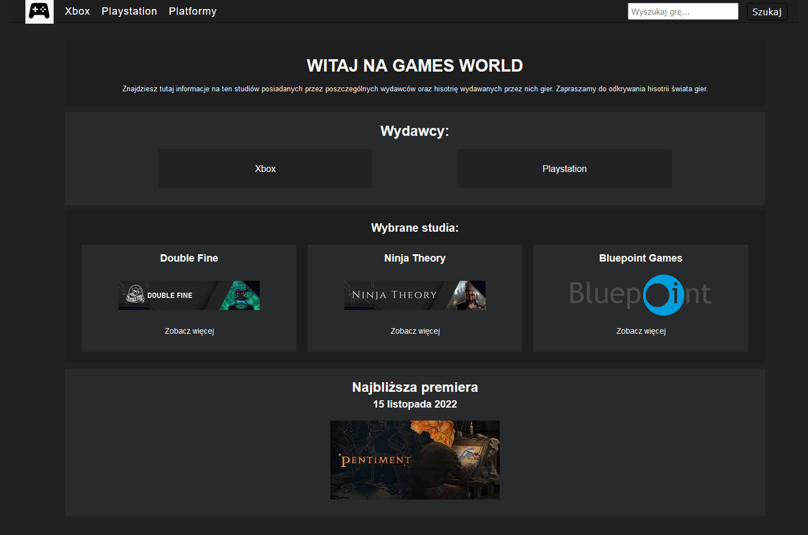
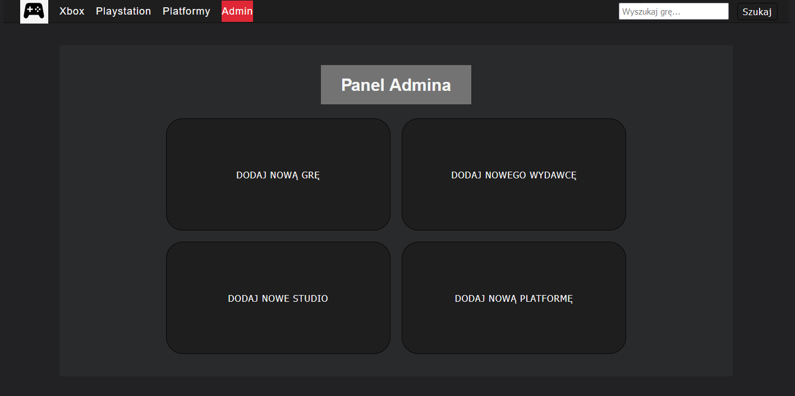
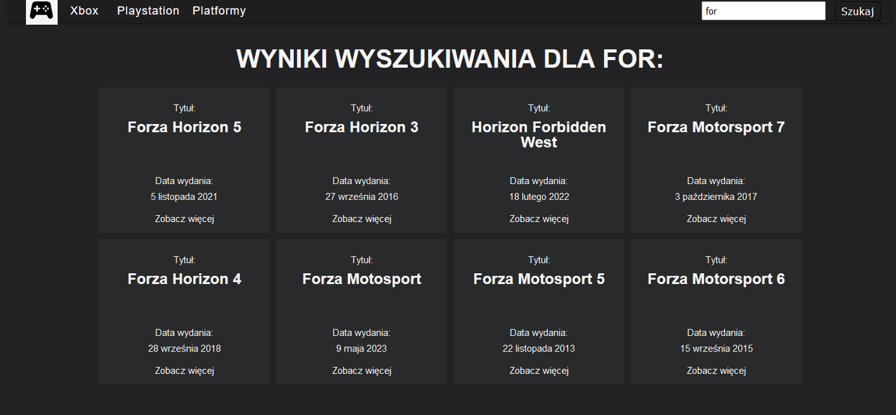
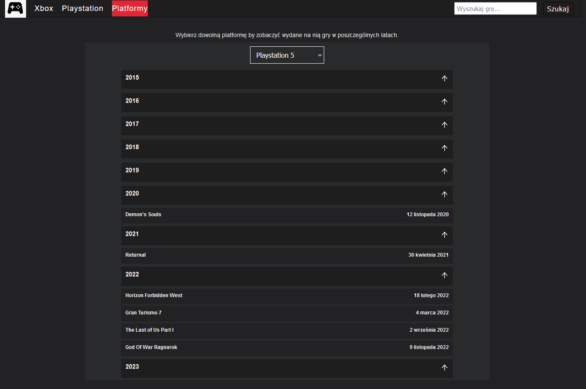
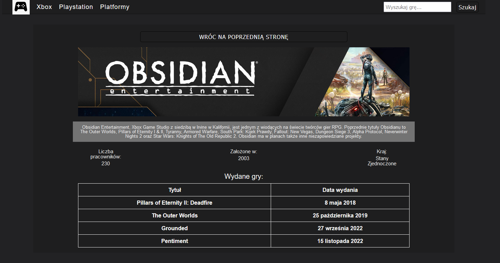

# Games World - frontend

### The goal of this project is has place where I can see all current and past games released on available platforms.  




## Features:
### Admin panel - application has login page where admin can log in and get access for admin panel where can add and edit data. Application using token to authorize admin actions.



### Searchbar - user can use search bar to find any game which is in database. You can write only part of title game, and you see connected results.



### Dates - all dates on app are listed chronologically.




### TECHNOLOGY:
- TypeScript
- ReactJS
- React-router-dom
- React-hook-form 
- Axios
- Framer-motion

## Setup
To run this project, first you have go to

https://github.com/mateuszslowinski/gamesBackand

Then clone this repo to your desktop and to install all the dependencies by:
```sh
  npm install 
  ```
Next you can run by:
```sh
  npm start
```
  